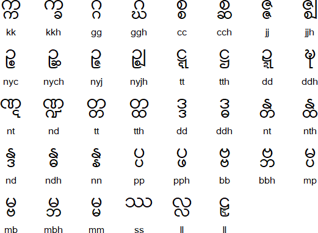

# Myanmar Characters to English Converter

[Burmese Phonology
](https://en.wikipedia.org/wiki/Burmese_phonology)

[Burmese](https://en.wikipedia.org/wiki/Myanmar), or [Myanmar](https://en.wikipedia.org/wiki/Myanmar), is a member of the [Lolo-Burmese](https://en.wikipedia.org/wiki/Lolo-Burmese_languages) branch of the [Sino-Tibetan language](https://en.wikipedia.org/wiki/Sino-Tibetan_languages) family. It is spoken mainly in [Myanmar ([Burma](https://en.wikipedia.org/wiki/Bamar_people))](https://en.wikipedia.org/wiki/Myanmar), where it is the official language. In 2007 there were about 33 million people who spoke [Burmese](https://en.wikipedia.org/wiki/Burmese_language) as a first language. There are also thought to be another 10 million who speak it as a second language.

[Standard Burmese](https://en.wikipedia.org/wiki/Burmese_language) is spoken in the Irrawaddy River valley. Within that area there are minor differences in vocabulary and pronunciation between the [Mandalay](https://en.wikipedia.org/wiki/Mandalay) dialect of [Upper Burma](https://en.wikipedia.org/wiki/Upper_Myanmar) and the [Yangon](https://en.wikipedia.org/wiki/Yangon) dialect of [Lower Burma](https://en.wikipedia.org/wiki/Lower_Myanmar). Burmese dialects in other parts of Burma differ more from the standard, but they are all more or less mutually intelligible.

There are two registers of Burmese: high and low. The high register is used in formal literature, newspapers, radio and formal speeches. The low register is used in television, comics, informal literature, and everyday conversation. Since the 1960s some Burmese writers have promoted the use of the low register, and have suggest the abandoning of the high register.

The name Myanmar (မြန်မာ [mjəmà]) is the high register name for the country, and Burma (ဗမာ [bəmà]) is the low register name. Both names derive from the [Bamar people](https://en.wikipedia.org/wiki/Bamar_people) (ဗမာလူမျိုး [bəmà lùmjó]), the largest ethnic group in Burma. The full official name of the country is the "Republic of the Union of Myanmar" (ပြည်ထောင်စုသမ္မတ မြန်မာနိုင်ငံတော် [pjìdàʊɴzṵ θàɴməda̰ mjəmà nàɪɴŋàɴdɔ̀]).

# Written Burmese
The Burmese or Myanmar script developed from the [Mon script](https://en.wikipedia.org/wiki/Mon%E2%80%93Burmese_script), which was adapted from a [southern Indian script](https://en.wikipedia.org/wiki/Pallava_script) during the 8th century. The earliest known inscriptions in the Burmese script date from the 11th century.

# Notable Features
Type of writing system: [Abugida](https://en.wikipedia.org/wiki/Abugida) / Syllabic Alphabet - each letter has an inherent [vowel](https://en.wikipedia.org/wiki/Vowel), which is pronounced [a̰] or [ə] [a]. Other [vowels](https://en.wikipedia.org/wiki/Vowel) sounds are indicated using separate letters or diacritics which appear above, below, in front of, after or around the consonant.

## Burmese alphabet
The [Burmese alphabet](https://en.wikipedia.org/wiki/Burmese_alphabet) ([Burmese](https://en.wikipedia.org/wiki/Burmese_language): မြန်မာအက္ခရာ mranma akkha.ra, pronounced [[mjəmà ʔɛʔkʰəjà](https://en.wikipedia.org/wiki/Help:IPA/Burmese)]) is an [abugida](https://en.wikipedia.org/wiki/Abugida) used for writing [Burmese](https://en.wikipedia.org/wiki/Burmese_alphabet). It is ultimately adapted from a [Brahmic script](https://en.wikipedia.org/wiki/Brahmic_scripts), either the [Kadamba](https://en.wikipedia.org/wiki/Kadamba_script) or [Pallava alphabet](https://en.wikipedia.org/wiki/Pallava_script) of [South India](https://en.wikipedia.org/wiki/South_India). The [Burmese alphabet](https://en.wikipedia.org/wiki/Burmese_alphabet) is also used for the liturgical languages of [Pali](https://en.wikipedia.org/wiki/Pallava_script) and [Sanskrit](https://en.wikipedia.org/wiki/Sanskrit). In recent decades, other, related alphabets, such as [Shan](https://en.wikipedia.org/wiki/Shan_language#Alphabet) and modern [Mon](https://en.wikipedia.org/wiki/Mon_alphabet), have been restructured according to the standard of the [Burmese alphabet](https://en.wikipedia.org/wiki/Burmese_alphabet).

Burmese is written from left to right and requires no spaces between words, although modern writing usually contains spaces after each clause to enhance readability and to avoid grammar ambiguity. There are several systems of transliteration into the Latin alphabet; for this article, the [MLC Transcription System](https://en.wikipedia.org/wiki/MLC_Transcription_System) is used.

# Writing direction: left to right in horizontal lines.
Script family: Proto-Sinaitic, Phoenician, Aramaic, [Brāhmī](https://en.wikipedia.org/wiki/Brahmic_scripts), Tamil-Brahmi, [Pallava](https://en.wikipedia.org/wiki/Pallava_script), [Burmese](https://en.wikipedia.org/wiki/Burmese_alphabet)
Used to write: [Burmese/Myanmar (ဗမာစကား)](https://en.wikipedia.org/wiki/Burmese_language), Karen and Mon.
The rounded appearance of letters is a result of the use of palm leaves as the traditional writing material. Straight lines would have torn the leaves. The Burmese name for the script is ca-lonh 'round script'.
[Burmese is a tonal language](https://en.wikipedia.org/wiki/Burmese_language) with three main tones (high, low and creaky) and two other tones (stopped and reduced). The tones are indicated in writing using diacritics or special letters.

### Consonants

### Notes

> ဃ (gh), ဈ (jh), ဋ (ṭ), ဌ (ṭh), ဍ (ḍ), ဎ (ḍh), ဏ (ṇ), ဓ (dh), and ဠ (ḷ) are used mainly in words of Pali origin.
ၐ (ś) and ၑ (ṣ) are only used in Sanskrit words
When combined with the diacritic ာ or as a final, ည becomes ဉ
ရ is often pronounced [ɹ] in words of Pali or foreign origin.
အ is treated as a consonant and represents an initial glottal stop in syllables with no other consonant.
The letter န (n) has a different form when there is a diacritic under it, e.g နု (nu)

### Stacked consonants

### Independent vowels and vowel diacritics

### Medial consonant diacritics with မ (m)

### Syllable rhymes with က (k)

### Other symbols

### Numerals

# Sample Text in Burmese

> လူတိုင်းသည် တူညီ လွတ်လပ်သော ဂုဏ်သိက္ခာဖြင့် လည်းကောင်း၊ တူညီလွတ်လပ်သော အခွင့်အရေးများဖြင့် လည်းကောင်း၊ မွေးဖွားလာသူများ ဖြစ်သည်။ ထိုသူတို့၌ ပိုင်းခြား ဝေဖန်တတ်သော ဉာဏ်နှင့် ကျင့်ဝတ် သိတတ်သော စိတ်တို့ရှိကြ၍ ထိုသူတို့သည် အချင်းချင်း မေတ္တာထား၍ ဆက်ဆံကျင့်သုံးသင့်၏။

# Transliteration

> lutuing:sany tu-nyi lwatlapsau: gun.sikhka.hprang. lany:kaung:, tu-nyi-lwatlapsau: ahkwang.-are:mya:hprang. lany:kaung:, mwe:hpwa:la.su-mya: hpracsany. htuisutui.hnai puing:hkra: wehpantatsau: nyanhnang. kyang.wat si.tatsau: cittui.hri.kra.rwe htuisutui.sany ahkyang:hkyang: mettahta:rwe hcakhcamkyang.sum:sang.e.

# IPA transcription

> lù.dáɪ̯ɴ.ðè tù.ɲì lʊʔ.laʔ.θɔ́ go̰ʊ̯ɴ.ðeɪ̯ʔ.kʰa̰.pʰjɪ̰ɴ lé.gáʊ̯ɴ | tù.ɲì lʊʔ.laʔ.θɔ́ ʔə.kʰwɪ̰ɴ.ʔə.jé.mjá.pʰjɪ̰ɴ lé.gáʊ̯ɴ | mwé.pʰwá.la̰.ðù.mjá pʰjɪʔ.θè || tʰò.ðù.do̰-n̥aɪ̯ʔ páɪ̯ɴ.ʨʰá wè.pʰàɴ.taʔ.θɔ́ ɲàɴ.n̥ɪ̰ɴ ʨɪ̰ɴ.wʊʔ θḭ.daʔ.θɔ́ seɪ̯ʔ.to̰.ʃḭ.ʥa̰-ɥḛ tʰò.ðù.do̰.ðè ʔə.ʨʰɪ́ɴ.ʥɪ́ɴ meʔ.ta̰.dá-ɥḛ sʰeʔ.sʰàɴ.ʥɪ̰ɴ.ðóʊ̯ɴ.ðɪ̰ɴ-ḭ​

About [IPA](https://en.wikipedia.org/wiki/Help:IPA/Burmese) |
Transliteration and transcription by Otavio

# Translation

> All human beings are born free and equal in dignity and rights. They are endowed with reason and conscience and should act towards one another in a spirit of brotherhood.

### Burmese phrases
[ilanguages](http://ilanguages.org/burmese_phrases.php) [asiapearltravels](http://www.asiapearltravels.com/language/lesson28.php) [wikitravel](http://wikitravel.org/en/Burmese_phrasebook) [seap](http://seap.einaudi.cornell.edu/system/files/Burmese Language Phrases with Audio_0.pdf) [asianhorizons](http://www.asianhorizons.co.uk/tours-of-burma-phrases-burmese/) [englishspeak](http://www.englishspeak.com/my/english-lessons.cfm)

### Online Burmese dictionaries
[myordbok](https://www.myordbok.com) [burmese-dictionary](https://www.burmese-dictionary.org/) [myanmar-dictionary](https://www.myanmar-dictionary.org/) [sealang](http://sealang.net/burmese/) [lexilogos](http://www.lexilogos.com/english/burmese_dictionary.htm)

### Free Burmese fonts
[seasite](http://www.seasite.niu.edu/seasite.htm) [wazu](http://www.wazu.jp/gallery/Fonts_Myanmar.html) [angelfire](http://www.angelfire.com/country/burmesefont/)

### Online Burmese radio
[voanews](http://www.voanews.com/burmese/)
[bbc](http://www.bbc.co.uk/burmese/)
[rfa](http://www.rfa.org/burmese/)
[soundcloud](https://soundcloud.com/dvbradio)

Ref: [omniglot](https://omniglot.com/)

[Information about the Burmese language](http://en.wikipedia.org/wiki/Burmese_alphabet)